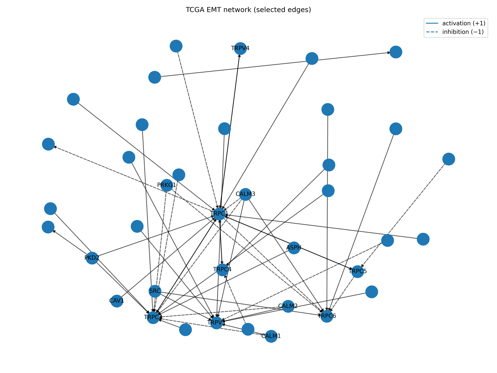
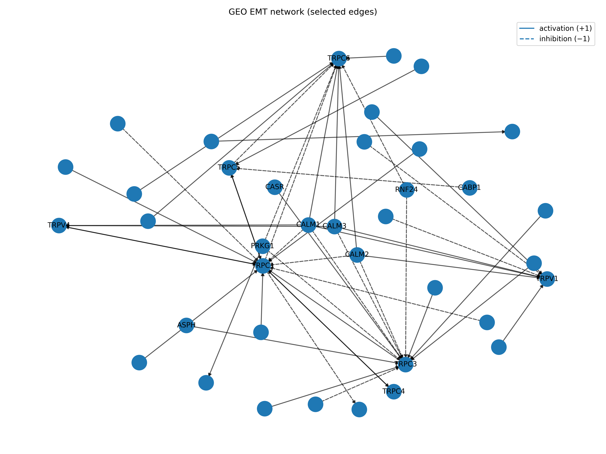
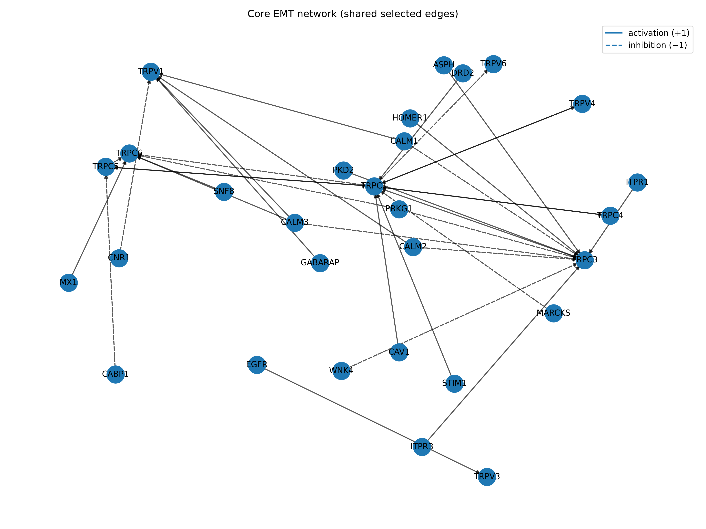

# EMT Network Inference (TCGA BRCA + GEO GSE96058) using CORNETO + OmniPath

This project performs EMT scoring and network inference in breast cancer cohorts using:
- **EMT scoring** based on KS and 76GS EMT signatures
- **Network inference** using **CORNETO (PCST)** with **OmniPath** as a signed, directed prior interaction network

The workflow is run independently on:
- **TCGA BRCA** (n = 1218 samples)
- **GEO GSE96058** (n = 3273 samples)

---

## Repository structure

- `notebooks/` : analysis notebooks (01–07)
- `resources/` : EMT signature files and OmniPath signed, directed networks
- `results/` : final output tables (scores, inferred networks, hubs, overlap summary)
- `figures/` : network figures (PNG)
- `reports/` : short summaries (e.g., EMT scoring summary)

Large data files are not tracked in git (see `.gitignore`).

---

## Workflow (notebooks)

Run notebooks in order:

1. `01_...` Download TCGA BRCA expression for EMT signature genes  
2. `02_...` Download GEO GSE96058 expression for EMT signature genes  
3. `03_...` QC + create a common EMT gene list across cohorts  
4. `04_...` Compute EMT scores (KS and 76GS), check correlation, assign EMT groups (E / Hybrid / M)  
5. `05_...` Generate EMT signature (M vs E logFC) + prepare OmniPath network  
6. `06_...` CORNETO network inference (PCST) + overlap analysis  
7. `07_...` Visualization + hub tables + final figures  

---

## EMT scoring results

### Cohorts
- TCGA BRCA: **1218 samples**, **341 genes**
- GEO GSE96058: **3273 samples**, **346 genes**

### Correlation between KS and 76GS scores
- TCGA: Pearson r = **-0.741**; Spearman rho = **-0.811**
- GEO:  Pearson r = **-0.831**; Spearman rho = **-0.897**

### EMT group counts (consensus rank; tertiles)
TCGA:
- E: 406
- Hybrid: 407
- M: 405

GEO:
- E: 1091
- Hybrid: 1091
- M: 1091

Outputs:
- `results/emt_scores_tcga.csv`
- `results/emt_scores_geo.csv`

(See `reports/summary.md` for the same values.)

---

## Network inference results (CORNETO + OmniPath)

We infer compact EMT-associated networks independently in TCGA and GEO using CORNETO (PCST) and an OmniPath signed, directed prior network.

Summary (from `results/network_overlap_summary.txt`):

**TCGA**
- selected nodes = **38**
- selected edges (PCST) = **48**
- induced edges = **87**

**GEO**
- selected nodes = **38**
- selected edges (PCST) = **51**
- induced edges = **82**

**Overlap**
- shared nodes = **31** (68.89%)
- shared selected edges (PCST) = **35** (54.69%)
- shared induced edges = **70** (70.71%)

Key network outputs:
- Selected-edge networks (primary CORNETO outputs)
  - `results/tcga_pcst_selected_edges.tsv`
  - `results/geo_pcst_selected_edges.tsv`
- Induced subnetworks (context networks among selected nodes)
  - `results/tcga_induced_subnetwork.tsv`
  - `results/geo_induced_subnetwork.tsv`
- Core overlap network (shared selected edges)
  - `results/overlap_core_selected_edges.tsv`
- Hub tables (highest degree nodes)
  - `results/tcga_top_hubs_selected.tsv`
  - `results/geo_top_hubs_selected.tsv`
  - `results/core_top_hubs_selected.tsv`

---

## Network figures

Solid arrows indicate **activation (+1)** and dashed arrows indicate **inhibition (−1)** based on OmniPath annotations.  
Node labels highlight the most connected genes (hub candidates) for readability.

### TCGA BRCA inferred EMT network (selected edges)

Interpretation (simple):
- A compact signed, directed subnetwork selected by CORNETO to connect EMT-associated genes in TCGA BRCA.

### GEO GSE96058 inferred EMT network (selected edges)

Interpretation (simple):
- An independently inferred subnetwork using the same prior knowledge network, allowing comparison with TCGA.

### Core overlap EMT network (shared selected edges)

Interpretation (simple):
- Shared interactions selected in both cohorts, representing the most reproducible candidate EMT network in this project.

---

## Core network hubs (example)

From `results/core_top_hubs_selected.tsv`, the highest-degree nodes in the core overlap network include:
- TRPC1 (total degree 13)
- TRPC3 (total degree 11)
- TRPC6 (total degree 6)
- TRPV1 (total degree 5)
- TRPC5 (total degree 4)

These nodes are central within the shared network and are useful candidates for follow-up interpretation.

---

## Notes and limitations

- CORNETO selects edges from the OmniPath prior network; it does not discover new interactions.
- The inferred networks are hypothesis-generating and should be interpreted as candidate mechanisms consistent with EMT-associated expression changes.

## Citations (EMT scoring and CORNETO)

1. Byers LA, Diao L, Wang J, Saintigny P, Girard L, Peyton M, et al. **An epithelial-mesenchymal transition gene signature predicts resistance to EGFR and PI3K inhibitors and identifies Axl as a therapeutic target for overcoming EGFR inhibitor resistance.** *Clinical Cancer Research.* 2013;19(1):279–290. doi:10.1158/1078-0432.CCR-12-1558.

2. Tan TZ, Miow QH, Miki Y, Noda T, Mori S, Huang RYJ, Thiery JP. **Epithelial-mesenchymal transition spectrum quantification and its efficacy in deciphering survival and drug responses of cancer patients.** *EMBO Molecular Medicine.* 2014;6(10):1279–1293. doi:10.15252/emmm.201404208.

3. Rodriguez-Mier P, Garrido-Rodriguez M, Gabor A, Saez-Rodriguez J. **Unifying multi-sample network inference from prior knowledge and omics data with CORNETO.** *Nature Machine Intelligence.* 2025;7:1168–1186. doi:10.1038/s42256-025-01069-9.

